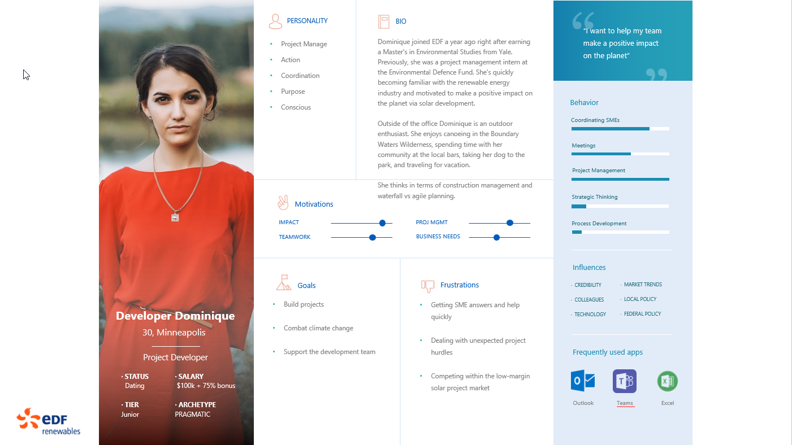
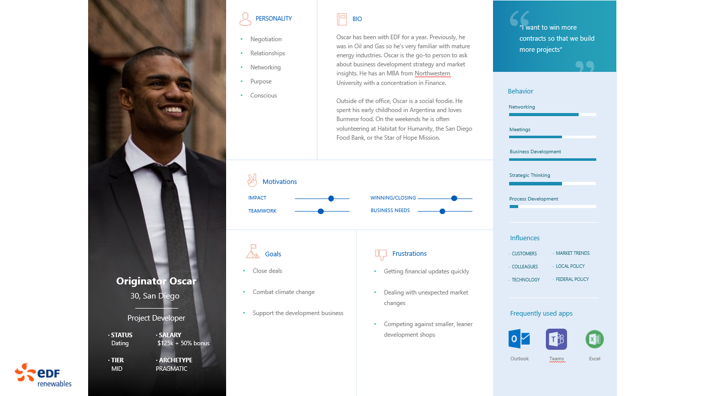
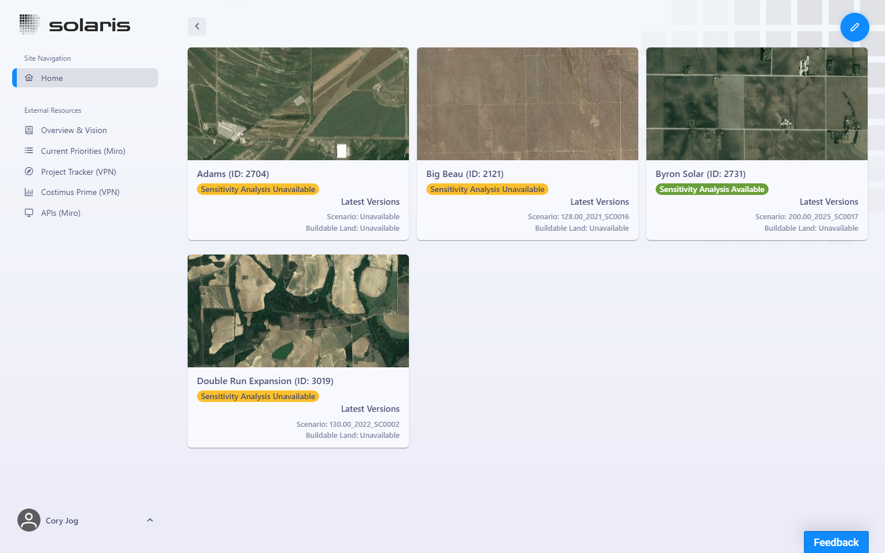
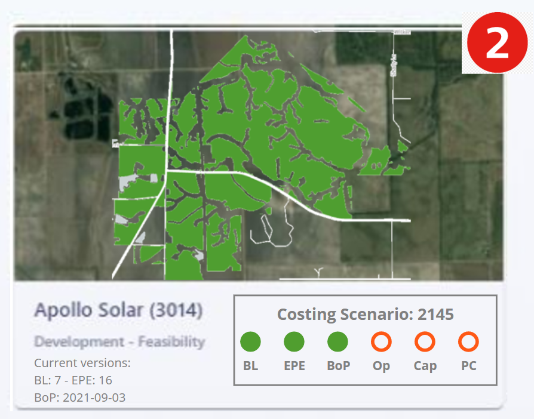
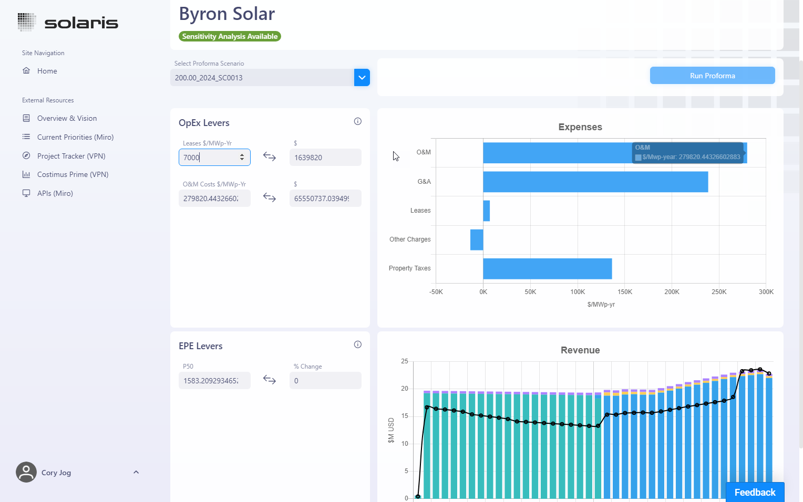

# Solaris

# Change History
2021.07.26 - Initial draft for comment  
2021.09.15 - Updated after feedback  
2021.10.05 - Updated with prototype UI designs
2022.01.11 - Updated after New Year

# Overview:
### "Push a button, get an optimized solar project"  
The reason for Solaris is to enable Project Developers and Originators to get the most competitive project configuration with the lowest possible LCOE in real-time. The hope is that this leads to a competitive advantage such that EDF constructs an additional 150 MW project per year. This translates into ___$37.5M___ per year in value by assuming EDF realizes approximately $75M NPV at CoD and assuming the Digital organization gets half the credit for the project being built.

This comes from the Development business setting the 2021 strategy in January:

# Objectives
- "Hey Solaris, reduce my CapEx by three cents and recalculate my PPA price by keeping the adjusted RRR constant"
- Lead to an extra 150 MW solar project constructed per year.
- Get an optimized solar project configuration in real-time. 100k scenarios in under 10 minutes.  
- The optimization process will be accurate to within $0.50 of the full V&A proforma modeling.
- Improve transparency and coordination between development and SMEs 
- Level up less experienced developers by giving them a window into the drivers behind a bid price.
- Reduce SME workload.

# Success Metrics
### Value Stream Mapping

# Release Plan
- 2021 - Prototyping
    - [Solaris](https://edf-gsp.com/solaris/)
    - [Computron](computron.edfr.com)
    - [Buildable Land Library](https://share.streamlit.io/edf-re/gsp_solaris_bl_library/main/app.py)
    - [EPE Library](https://share.streamlit.io/edf-re/gsp_solaris_epe_library/main/app.py)
- Q1 2022 - Proforma  
    - Pre-tax cashflow model (Revenue, Expenses, CapEx, EBITDA)
- Q2 2022 
    - Proforma
        - UIRR
        - LCOE
        - Tax Equity
    - EPEs
        - Layout
        - Climate selection
        - Performance modeling

# Personas
[Personas Deck on Sharepoint](https://edfrna.sharepoint.com/sites/US-GSPDigital/_layouts/15/Doc.aspx?OR=teams&action=edit&sourcedoc={B3F49786-79BA-4A00-BA9C-58025DB20339})

### Project Developer Dominique (PRIMARY)
 

### Originator Oscar
 

# User Scenarios
Its a Friday in late August and Dominique has a weekend canoeing trip planned with her community of friends. Its about 8:45 am and she's just arrived at the Minneapolis office. She puts her bag down at her desk and heads toward the kitchen for her first cup of coffee. She's really looking forward to leaving the office a bit early to head out on her trip this afternoon. 

As Dominique checks her phone she sees a last-minute announcement for an RFP due on Monday. "Why do utilities do this to us?", she exclaims as she's heading back to her desk. A difficult part of this job is managing the uncertainty around high-priority, short-deadline delivery dates. Thankfully, she has access to Solaris. Before she's back at her desk she's opened the Solaris app to check on the projects within her portfolio. She can see there are a couple notifications to show that the V&A team had updated Merchant Curves a couple days prior. Seems manageable because the module and inverter road maps had also been updated and they seem to offset each other. 

Back at her desk, within an hour Dominique has pulled up three pertinent projects. She's grab the latest, most optimal iteration of each, confident that Solaris can instantly update all the relative aspects of a project and then optimize the configuration at the push of a button. Dominique used to have to worry about the solar technology road map getting updated or forward-price curves changes but now those changes are automatically pushed to her phone in real-time. She no longer has to worry about having to coordinate across eight different groups to get the current project assumptions for pricing committee approval. 

Within two hours, Dominique has pricing committee approval to submit the three projects to the RFP, which she can easily do today before heading out on her trip as planned. Each project was considered and ultimately approved using a centralized dashboard that automatically serves up the latest project details without having to manually populate a deck. There was one project that was a bit under the hurdle rate but the region has a strategy in place where Dominique six levers that can be affected. Only three of those improvements or mitigations have to be successful within the next six months for the project to work. 

As Dominique wraps up the RFP application she's just in time to head out at 3 pm for the three hour ride to the trip put-in. She won't worry about the RFP or the accuracy of the project modeling as she paddles with her friends and drinks around a campfire that evening. 

# Features In
- View small project portfolio (less than eight projects) 
- Results delivered within seconds
- Proforma clone
- Easily accessed via a phone or tablet or laptop
- Edit an existing scenario

# Features Out
- SME tools (providing front ends for Technical Services users)
    - Computron
    - EPE
    - CapEx and OpEx modeling
- Storage
- Prospecting (modeling across multiple sites)
- Competitor analysis (modeling non-EDF sites)
- GIS analysis

# Designs
  

# Open Issues
- Do we have the right slice?

# Q&A
__What is the difference between Solaris, Centralized Assumptions Database, and the Costing Database?__ 

Firstly, Solaris is the platform upon which EDF can build the capability to optimize projects using the computational power of the cloud. This means that within minutes, Solaris can model 10,000 different project scenarios and configurations to show you the 5 most competitive versions to bid into an RFP. It is easily accessible on your phone or tablet so that you have all the most recent assumptions, information and project details in real-time.

Solaris is powered by the Centralized Assumptions Database. All the most recent, project-agnostic information and current market assumptions developed by Technical Services are uploaded to the Centralized Assumptions Database. Those assumptions are then automatically ingested into Solaris so that you no longer have to worry about an update to the solar-module road map or a forward price curve change. Solaris also uses the same processes as the Costing Database so that you know there won't be any surprises when you go to PFM and V&A for Pricing Committee on Friday.

__What are the supporting metrics for the Success Metrics?__
#### Happiness
- Goal: For users (developers and originators) to feel like the platform is giving them a reliable answer, faster.
- Signals: A satisfaction rating from a survey.
- Metrics: Net Promoter Score, satisfaction, can you live without the product?

#### Engagement
- Goal: Maximize the number of project configurations considered by a developer.
- Signals: Number of configurations generated for a project. 
- Metrics: Count of `analysis_id`, average count per project, rate at which new projects are created. 

#### Adoption 
- Goal: For all of development to use the platform for solar project development.
- Signals: Number of developers and originators within GSP actively using the platform on a daily basis.
- Metrics: Percent of Development and Origination as daily active users. 

#### Retention
- Goal: For GSP development users to rely on the product for their daily work.
- Signals: Number of repeat users within GSP Development.
- Metrics: Repeat users, daily users, amount of time between user sessions.

#### Task Success
- Goal: For users to get an accurate predicted revenue stream. 
- Signals: The number of successful analyses performed on a project.
- Metrics: Analysis count, analyses per week per project. 

# Strategy Canvases
[Solaris Miro Board](https://miro.com/app/board/o9J_koCUiUI=/)
[Product Board](https://edfrna.sharepoint.com/sites/US-GSPDigital/_layouts/15/Doc.aspx?OR=teams&action=edit&sourcedoc={FE974070-E83F-411F-B55A-86337FF43070})  
[Roadmap on Miro](https://miro.com/app/board/o9J_koCUiUI=/?moveToWidget=3074457352733050831&cot=14)  
[Lean Canvas on Miro](https://miro.com/app/board/o9J_l5fqE60=/?moveToWidget=3074457361933883224&cot=14)
[UX Strategy on Miro](https://miro.com/app/board/o9J_l4rt6jw=/?moveToWidget=3074457361974012570&cot=14)

# Past Presentations
[Overview - July 2021](https://edfrna.sharepoint.com/sites/US-GSPDigital/_layouts/15/Doc.aspx?OR=teams&action=edit&sourcedoc={768F088E-38F7-4B73-8B18-56562C789A81})  
[Business Model](https://edfrna.sharepoint.com/sites/US-GSPDigital/_layouts/15/Doc.aspx?OR=teams&action=edit&sourcedoc={A73CF1B2-DD36-4E70-81A5-1AA8BB46F25A})  
[API Deployment - Python User Group - June 2021](https://edfrna.sharepoint.com/sites/US-GSPDigital/_layouts/15/Doc.aspx?OR=teams&action=edit&sourcedoc={752B3B94-9754-4F07-9AEC-1CA33ADBD245})  
[BOS - Aug 2012 on Miro](https://miro.com/app/board/o9J_lCDoBSo=/?moveToWidget=3074457361071563061&cot=14)  

# APIs
Full list of APIs is [here](https://miro.com/app/board/o9J_koCUiUI=/?moveToWidget=3074457364338537624&cot=14)

# Other considerations
None at this time. 